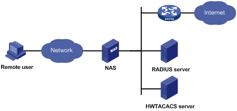

# Mike's reading

## OPS 301 readings

### CIDR Block Notation Explained in 2 Minutes

#### Explain each of the three A’s as you would to a non-technical family member. Use an analogy or a story.
    Authentication is the process of identifying a user.
    It is similar to getting a drivers license or passport checked at the airport.

    Authorization occurs after authentication, it allows or disallows the use of certain things.
    Like how a an employee has less authority then a manager, and a manager has less then the
    general manager.
#### What should the administrator do if the ACS server fails to authenticate a user during AAA implementation?
    the administrator should mention using the local database of the device as a backup, in the method list, to implement AAA.

#### What is the role of the NAS in the AAA implementation using an ACS server? Use a diagram.

### Radius

#### What are the benefits of using RADIUS for authentication and authorization?
    Some benefits of using radius include dial-in servers, virtual private network servers, wireless access points and managed access switches.

#### What is RADIUS and what does it stand for?
    Remote Authentication Dial-In User Service is a networking protocol that provides centralized AAA 

#### Research: What encryption algorithms does RADIUS use?
    The encryption mechanism is MD5 XORing with a shared secret.
